<h1>Task Manager</h1>
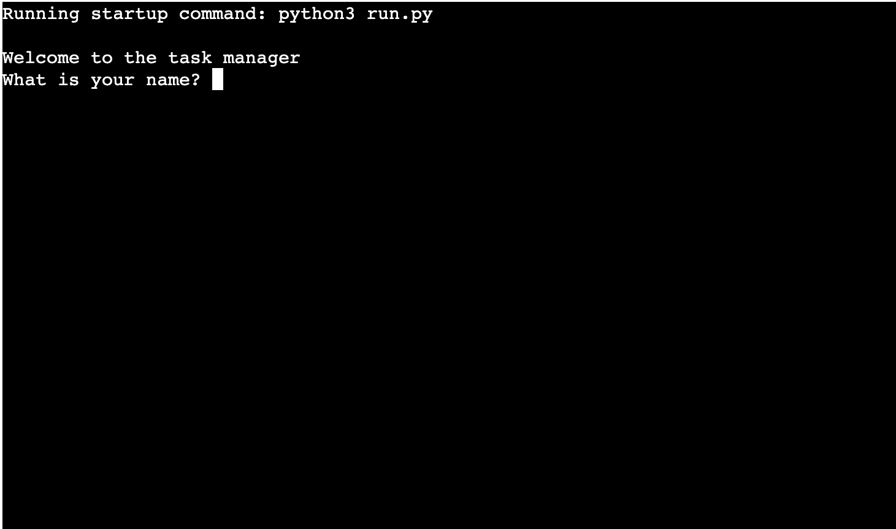

The Task Manager is a command-line application designed to help users organize and manage their tasks efficiently. It provides a simple interface to add, modify, complete, and remove tasks.

<h2>Contents</h2>
<ul>
    <li><a href="#user-experience">User Experience (UX)</a></li>
    <li><a href="#design">Design</a></li>
    <li><a href="#features">Features</a></li>
    <li><a href="#technologies-used">Technologies Used</a></li>
    <li><a href="#testing">Testing</a></li>
    <li><a href="#deployment">Deployment</a></li>
    <li><a href="#credits">Credits</a></li>
    <li><a href="#acknowledgements">Acknowledgements</a></li>
</ul>

<h2 id="user-experience">User Experience (UX)</h2>
<h3>Initial Discussion</h3>

The Task Manager is designed to be a simple and intuitive tool for managing tasks. It aims to provide an easy-to-use interface for adding, modifying, completing, and removing tasks.

<h3>Key Information for the Site</h3>
<ul>
    <li>New users can set up their task manager by providing their name.</li>
    <li>Users can add tasks with descriptions and optional due dates.</li>
    <li>Users can mark tasks as completed, remove tasks, and view all tasks.</li>
</ul>

<h3>User Stories</h3>
<h4>Client Goals</h4>
<ul>
    <li>Provide a simple program that users will want to use.</li>
    <li>Ensure the program meets the user’s needs.</li>
    <li>Make users feel their data is handled securely.</li>
</ul>

<h4>First Time Visitor Goals</h4>
<ul>
    <li>Understand how to use the program.</li>
    <li>Set up a task manager by providing their name.</li>
</ul>

<h4>Returning Visitor Goals</h4>
<ul>
    <li>Add new tasks with descriptions and optional due dates.</li>
    <li>View the list of all tasks.</li>
    <li>Mark tasks as completed.</li>
    <li>Remove tasks that are no longer needed.</li>
</ul>

<h2 id="design">Design</h2>
<h3>Flowcharts</h3>

The flowcharts were created using Miro to outline the flow of the application.

<h3>Flow Logic Diagram</h3>

The flow logic diagram illustrates the interactions and processes within the Task Manager program.

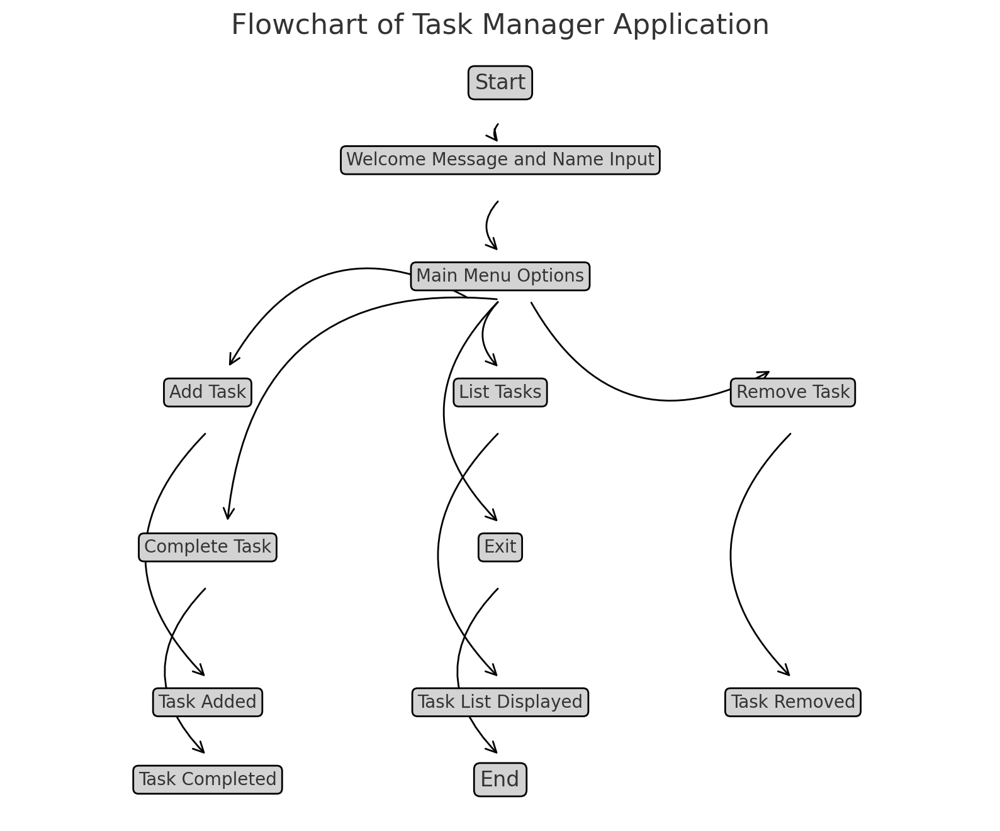

<h2 id="features">Features</h2>
<h3>Existing Features</h3>
<h4>Welcome Screen</h4>

The user is welcomed and prompted to enter their name, which is validated to ensure only alphabetic characters are used.

<h4>Interactive Mode</h4>

The main functionality of the task manager is provided in an interactive mode, where users can choose to add, list, remove, or complete tasks.

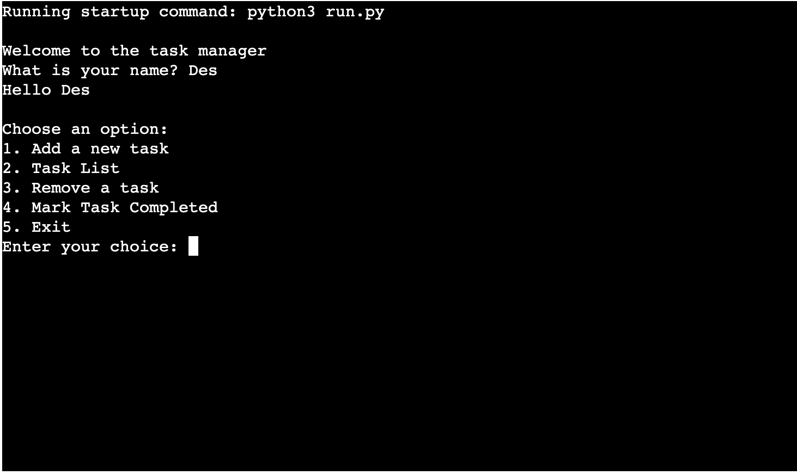

<h4>Add Task</h4>

Users can add tasks with descriptions and optional due dates. The task is saved and a confirmation message is displayed.

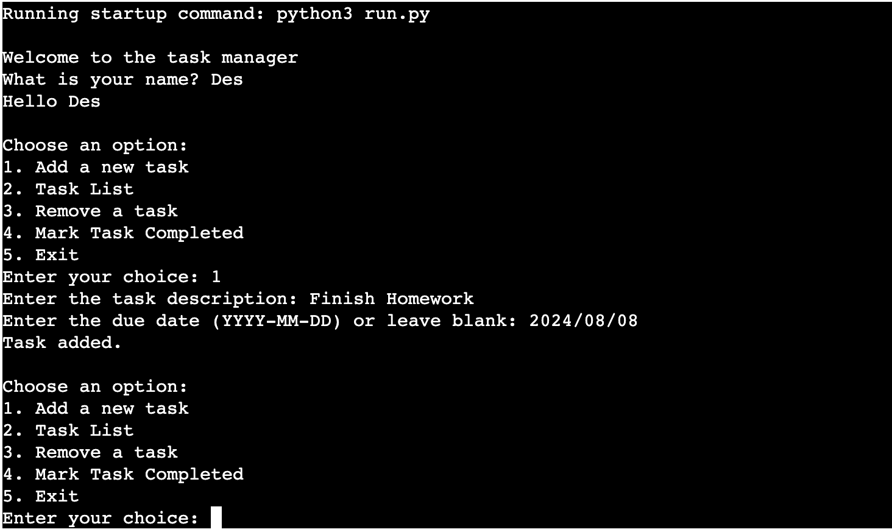
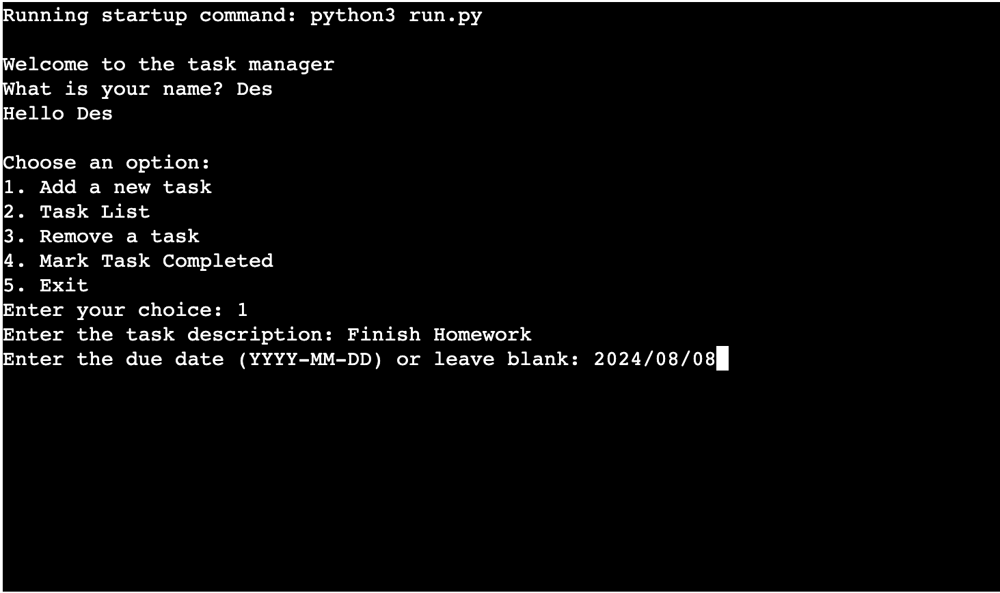

<h4>Task List</h4>

Users can view a list of all tasks, including their descriptions, due dates, and completion status.

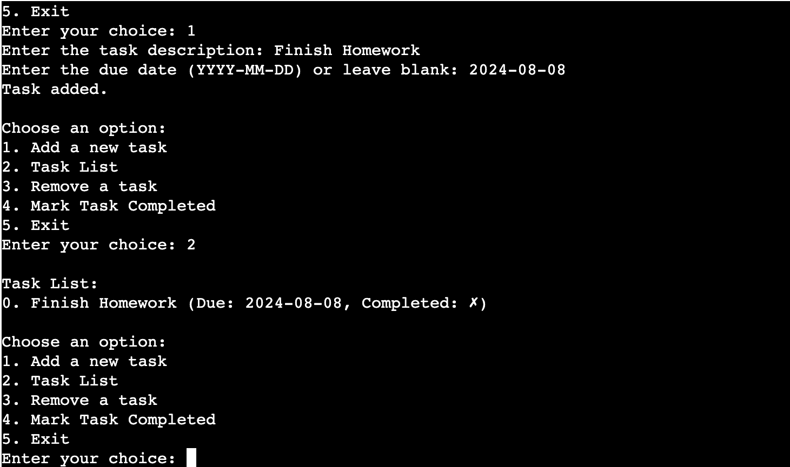

<h4>Remove Task</h4>

Users can remove tasks by specifying the index of the task. A confirmation message is displayed upon successful removal.

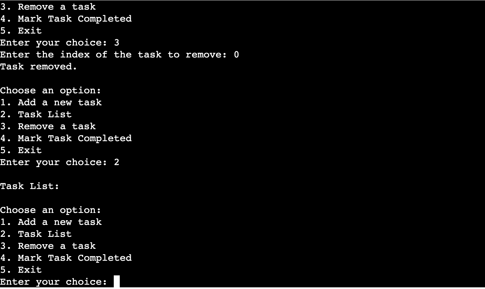

<h4>Mark Task Completed</h4>

Users can mark tasks as completed by specifying the index of the task. A confirmation message is displayed upon successful completion.

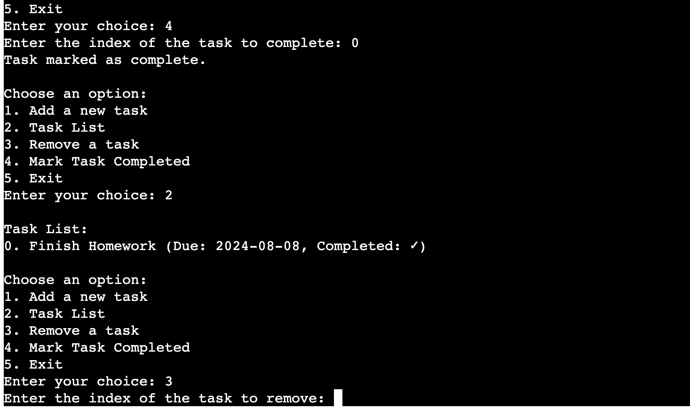

<h4>Exit</h4>

Users can exit the task manager. A farewell message is displayed.

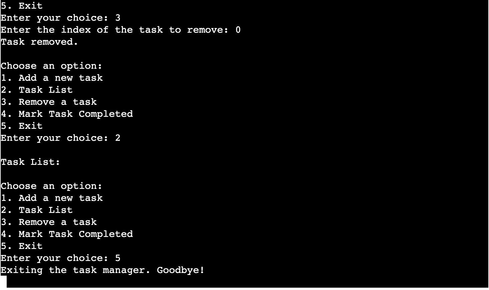

<h3>Future Implementations</h3>
<ul>
    <li>Implementing user authentication for personalized task management.</li>
    <li>Adding categories to tasks for better organization.</li>
    <li>Implementing a feature to edit tasks.</li>
</ul>

<h2 id="technologies-used">Technologies Used</h2>
<h3>Languages Used</h3>
<ul>
    <li>Python</li>
</ul>

<h3>Libraries Used</h3>
<ul>
    <li>argparse</li>
    <li>datetime</li>
</ul>

<h2 id="testing">Testing</h2>
<h3>Manual Testing</h3>
<ul>
    <li>Tested adding tasks with and without due dates.</li>
    <li>Tested listing all tasks.</li>
    <li>Tested removing tasks by index.</li>
    <li>Tested marking tasks as completed.</li>
    <li>Tested name validation to ensure only alphabetic characters are accepted.</li>
</ul>

<h3>Automated Testing</h3>

Automated testing was performed using the unittest module in Python. Test cases were created to ensure the functionality of adding, removing, and completing tasks.

<h3>Code Linting</h3>

The project was linted using the Code Institute Python Linter, and no errors were found.

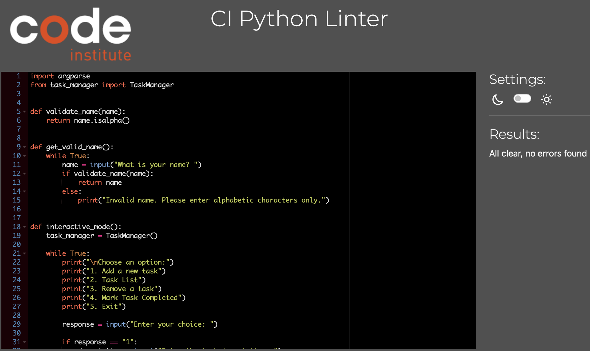
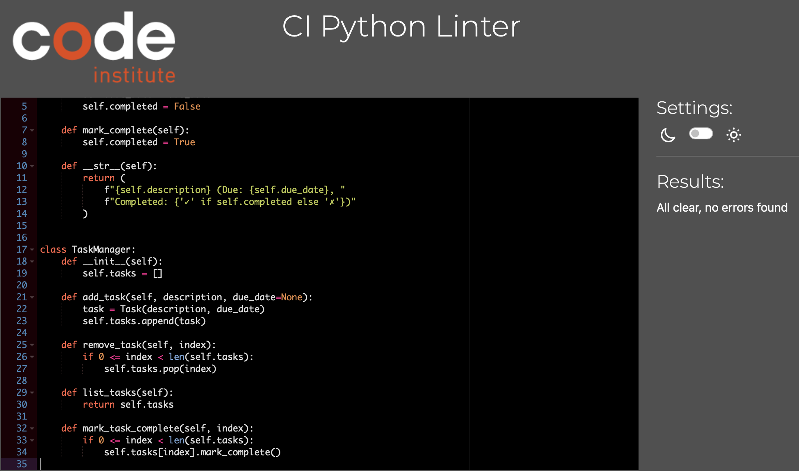

<h2 id="deployment">Deployment</h2>
<h3>Heroku Deployment</h3>

This project was deployed using Heroku.

<ol>
    <li>Create a <a href="https://id.heroku.com/login" target="_blank">Heroku</a> account or sign in if you already have one.</li>
    <li>Click the 'New' button and select 'Create new app'.</li>
    <li>Enter a unique name for your app and choose the region you are in.</li>
    <li>Click 'Create app'.</li>
    <li>Navigate to the 'Settings' tab and reveal config vars. Add any necessary config vars (e.g., TASKS_LOG_PATH if using a custom path).</li>
    <li>Scroll to the buildpacks section and add Python.</li>
    <li>Go to the 'Deploy' tab, select GitHub as the deployment method, and connect your GitHub account.</li>
    <li>Find your repository and connect it to Heroku.</li>
    <li>Enable automatic deploys to update the Heroku app with new commits to the selected branch, or manually deploy the branch.</li>
</ol>

<h2 id="credits">Credits</h2>
<h3>Code Used</h3>

The code for the task management functionality was written by me, using standard Python libraries.

<h2 id="acknowledgements">Acknowledgements</h2>

Special thanks to my mentor and the Code Institute community for their guidance and support throughout this project.

